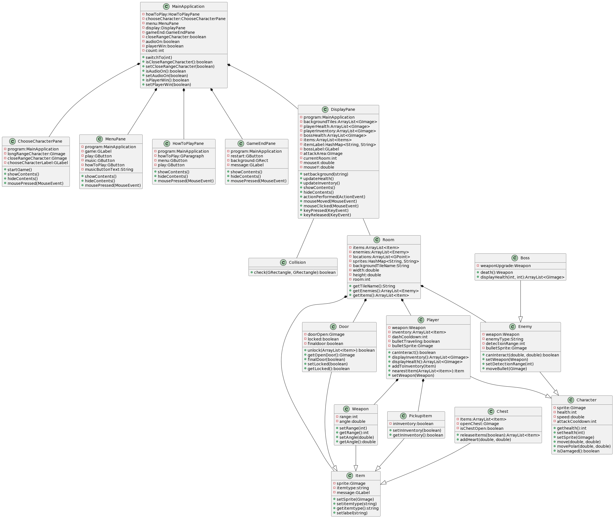

# Customer Statement of Requirements
The motivation for this project came from playing games and wanting to create an experience that allows players to feel a sense of achievement. The problem is making a project that has an objective that is both enticing and challenging. The objective needs to be appealing enough to keep the player engaged, but complex enough so that the player feels a sense of accomplishment when progressing in the game. This also includes: making this project without bugs. The solution to keeping the player engaged will be achieved through appealing visual themes and simple, yet effective, design of player control. This, combined with the reasonable difficulty of the enemies adds a layer of complexity that makes the game satisfying to beat. Implementation of rigorous game testing proved efficient in eliminating most, if not all, bugs that occured in the development of the game. One of the specific titles that inspired this project is *The Legend of Zelda: Ocarina of Time*. Some of the features implemented from it: the player’s health is represented by hearts and the player is able to attack enemies with melee or ranged attacks.

# Functional Requirements
## Use Case - Casual
The player starts with menu selection to configure audio, learn how to play the game, and playing the game by moving around, collecting items, and attacking enemies. If an enemy sees the player, it will attempt to attack in the player’s direction, and if successful, the player’s number of hearts is lowered, and if the player’s health is zero, the game is over. If the player is able to escape the final room, the player wins the game.

## Use Case - Full
The main menu can be used to toggle audio on and off, to learn how to play the game, and to start the game. The camera is always centered at the center of the room. Every room will have all edges of the screen blocked off. In every room, the player must find a key to unlock the next room. Once the key is found, the player can move to the next room by moving to the door and using the key to open it. When a player enters the next room, there will be enemies that spawn randomly at a minimum distance from the player. Enemies will move towards the player if the player is detected within the enemy’s detection radius. As long as the player is within that radius, the enemy will start moving. It’s possible to escape the detection radius of the enemy, usually with use of the dash feature. When the player is within the enemy’s detection radius, the enemy will attempt to attack, either by attempting to touch the player or by performing a long range attack. If the player is hit by an enemy or an enemy attack, the player will lose HP. The player also gains limited invincibility when hit. Attacks can be easier to dodge by using the dash feature. The direction of the dash is determined by the location of the player’s mouse in relation to the player. There is also a cooldown for the dash. If the player performs an attack, there is a delay before the player can attack again. Like the dash, the direction of the attack is determined by the player’s mouse. If the player is using a melee weapon, any enemies within the player’s attack area are damaged. If the player is using a ranged weapon, enemies hit by the bullet are damaged. The player will also have the opportunity to pick up hearts to regain HP. It’s possible to get more hearts than the starting 10 HP that are provided at the beginning. Enemies will start off with one or two HP, but going deeper into the dungeon means enemies will become more difficult. If the player attacks and defeats an enemy, the enemy will die. The game has multiple boss rooms. In each boss room, it is optional for the player to defeat the boss. The boss will have more HP and a personal HP display to stand out from normal enemies. 

## Use Case Diagram

## Use Cases - Unimplemented (consider for future)
Level selection would allow a user to choose which levels to go to that they have already visited. 

# Overview
Escape the Dungeon is a dungeon crawler where you can play as a knight or a wizard.
Escape or face your foes who stand in your way. 
Pick up items to better your odds.

# Features
- Main Menu

- How To Play instructions
- Audio can be turned on/off
- The Winning/Losing Screen has an option to restart

- You can choose to play as a Knight or a Wizard
- The Knight can attack from close range
- The Wizard can attack from long range
- Your character and Bosses have a health display

- Your character needs a key to open the door to access the next room
- Your character can dash and move in any direction
- Your character can pick up items and weapon upgrades
- Each room is randomized with multiple enemy and item types

- Enemies can detect if your character is within range
- If your character touches an enemy, you will lose health
- Certain enemies can attack from long range

# Features not implemented
- Select Level
- Tutorial
- Different types of weapons

# How to play
- Move the mouse and use the Left-Click button to navigate the main menu and toggle audio
- Press w, a, s, d to move up, down, left, right, respectively
- Press SHIFT to dash in the direction of the mouse
- Press the Left-Click button on the mouse to attack in the direction of the mouse
- Press e to interact with objects
- Press r to use a heart item

# How to build (Windows)
- Go to releases
- Download tea-win-x64.zip
- Extract the zip file
- Open the extracted folder
- Open the bin folder
- Run the tea.bat file
