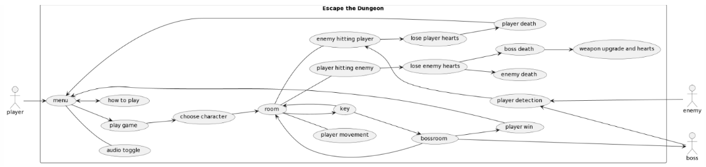
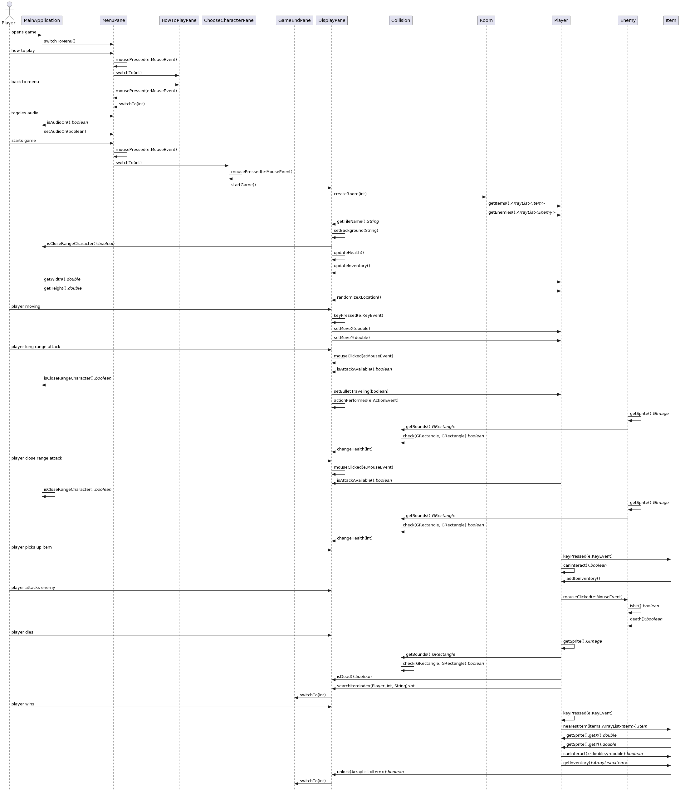
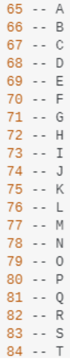

# Customer Statement of Requirements
The motivation for this project came from playing games and wanting to create an experience that allows players to feel a sense of achievement. The problem is making a project that has an objective that is both enticing and challenging. The objective needs to be appealing enough to keep the player engaged, but complex enough so that the player feels a sense of accomplishment when progressing in the game. This also includes: making this project without bugs. The solution to keeping the player engaged will be achieved through appealing visual themes and simple, yet effective, design of player control. This, combined with the reasonable difficulty of the enemies adds a layer of complexity that makes the game satisfying to beat. Implementation of rigorous game testing proved efficient in eliminating most, if not all, bugs that occured in the development of the game. One of the specific titles that inspired this project is *The Legend of Zelda: Ocarina of Time*. Some of the features implemented from it: the player’s health is represented by hearts and the player is able to attack enemies with melee or ranged attacks.

# Functional Requirements

**Use Case - Casual**

The player starts with menu selection to configure audio, learn how to play the game, and playing the game by moving around, collecting items, and attacking enemies. If an enemy sees the player, it will attempt to attack in the player's direction, and if successful, the player's number of hearts is lowered, and if the player's health is zero, the game is over. If the player is able to escape the final room, the player wins the game.

**Use Case - Full**

The main menu can be used to toggle audio on and off, to learn how to play the game, and to start the game. The camera is always centered at the center of the room. Every room will have all edges of the screen blocked off. In every room, the player must find a key to unlock the next room. Once the key is found, the player can move to the next room by moving to the door and using the key to open it. When a player enters the next room, there will be enemies that spawn randomly at a minimum distance from the player. Enemies will move towards the player if the player is detected within the enemy's detection radius. As long as the player is within that radius, the enemy will start moving. It's possible to escape the detection radius of the enemy, usually with use of the dash feature. When the player is within the enemy's detection radius, the enemy will attempt to attack, either by attempting to touch the player or by performing a long range attack. If the player is hit by an enemy or an enemy attack, the player will lose HP. The player also gains limited invincibility when hit. Attacks can be easier to dodge by using the dash feature. The direction of the dash is determined by the location of the player's mouse in relation to the player. There is also a cooldown for the dash. If the player performs an attack, there is a delay before the player can attack again. Like the dash, the direction of the attack is determined by the player's mouse. If the player is using a melee weapon, any enemies within the player's attack area are damaged. If the player is using a ranged weapon, enemies hit by the bullet are damaged. The player will also have the opportunity to pick up hearts to regain HP. It's possible to get more hearts than the starting 10 HP that are provided at the beginning. Enemies will start off with one or two HP, but going deeper into the dungeon means enemies will become more difficult. If the player attacks and defeats an enemy, the enemy will die. The game has multiple boss rooms. In each boss room, it is optional for the player to defeat the boss. The boss will have more HP and a personal HP display to stand out from normal enemies. 

**Use Case Diagram**

**Use Cases - Unimplemented (consider for future)**

Level selection would allow a user to go back to levels that they have already visited. Level selection would allow a user to choose which levels to go to that they have already visited. Animating the character sprites would make the visuals more appealing. Also, adding features like character sprint and more attacking features is another aspect we’re excited about.

# Class Diagram and Interface Specification
1. Player.nearestItem()
2. Collision.check()
3. Room.getEnemies()

**MainApplication:** switches between different panes.

**ChooseCharacterPane:** option to choose knight or wizard. switches to DisplayPane.

**MenuPane:** option to play the game, go to HowToPlayPane, or toggle music on or off. 

**HowToPlayPane:** displays instructions on how to play. switches to MenuPane.

**DisplayPane:** where most of the game logic occurs.

**Item:** provides a framework for any interactable object in the game.

# Interaction Diagrams

A Collision class along with its static method was used to check for any collisions occurring in the game. This was done so that any collision in the game could be checked by simply calling Collision.check() on two GRectangles. A createRoom() method was used for getting and setting the items, enemies, and a new background for each room. It’s a useful method because a Room must be created each time the player unlocked the door to the next room. The method changeHealth() would receive an integer and was used to change the player’s health each time the player was hit. It also was used for when the enemy was hit by the player to deplete the enemy’s health. 

# References with Annotations

- [Key Code Source](https://stackoverflow.com/questions/15313469/java-keyboard-keycodes-list) - Key codes helped to determine which key on the keyboard that the user pressed, which helped with the implementation of the logic for player movement, use/pickup items, etc.
- [Interact Lab Source](https://onzfonz.github.io/comp55/labs/5-Interact.html) - Helped with detection of mouse movement, especially for player attack and dash.
- [Timer Lab Source](https://onzfonz.github.io/comp55/labs/10-Timer.html) - Helped with using timer for setting up main game logic
- [HashMap Lab Source](https://onzfonz.github.io/comp55/labs/12-Hash.html) - Helped with using HashMaps to quickly access sprites and adjust item labels
- [Decomposition Lab Source](https://onzfonz.github.io/comp55/labs/11-Decomp.html) - Helped with solving complex problems by breaking them down into smaller segments