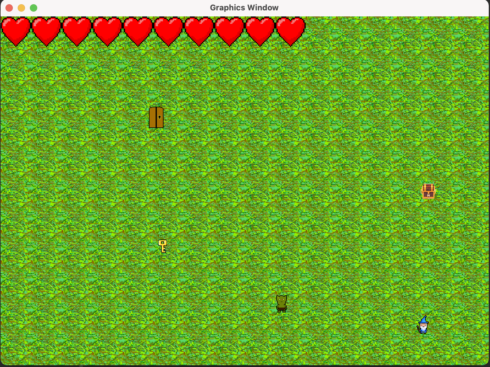

# Overview
Escape the Dungeon is a dungeon crawler where you have the option to play as a knight or a wizard.
The main objective of the game is to escape the dungeon. 
You have the option to fight the enemies and pick up items. 
# Features
- Main Menu

- How To Play
- Audio
- Player Winning/Losing Screen has an option to restart.

- Player can choose to play as a Knight or a Wizard.
- The Knight can attack from close range.
- The Wizard can attack from long range.
- Player and Bosses have a health display.
- Player needs the key to open the door and access the next room.
- Player can dash and move in any direction.
- Player can pick up items and weapon upgrades.
- Each room is randomized.

- All enemies can detect the player if the player is within range.
- All enemies can damage the player if the player is touching the enemy.
- Some enemies can attack the player from long range.
- There are multiple enemy and item types.

 
# Features not implemented
- Select Level
- Tutorial
- Different types of weapons

