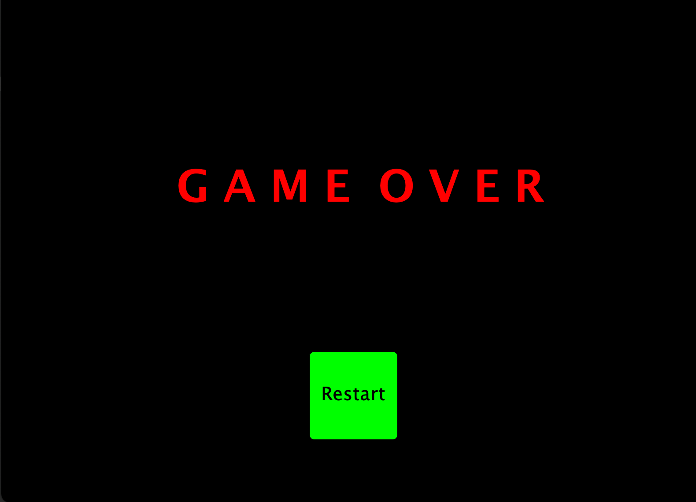

# Overview
Escape the Dungeon is a dungeon crawler where you can play as a knight or a wizard.
Escape or face your foes who stand in your way. 
Pick up items to better your odds.

# Features
- Main Menu

- How To Play instructions
- Audio can be turned on/off
- The Winning/Losing Screen has an option to restart

- You can choose to play as a Knight or a Wizard
- The Knight can attack from close range
- The Wizard can attack from long range
- Your character and Bosses have a health display

- Your character needs a key to open the door to access the next room
- Your character can dash and move in any direction
- Your character can pick up items and weapon upgrades
- Each room is randomized with multiple enemy and item types

- Enemies can detect if your character is within range
- If your character touches an enemy, you will lose health
- Certain enemies can attack from long range

# Features not implemented
- Select Level
- Tutorial
- Different types of weapons

# How to play
- Move the mouse and use the Left-Click button to navigate the main menu and toggle audio
- Press w, a, s, d to move up, down, left, right, respectively
- Press SHIFT to dash in the direction of the mouse
- Press the Left-Click button on the mouse to attack in the direction of the mouse
- Press e to interact with objects
- Press r to use a heart item

# How to build (Windows)
- Go to releases
- Download tea-win-x64.zip
- Extract the zip file
- Open the extracted folder
- Open the bin folder
- Run the tea.bat file
