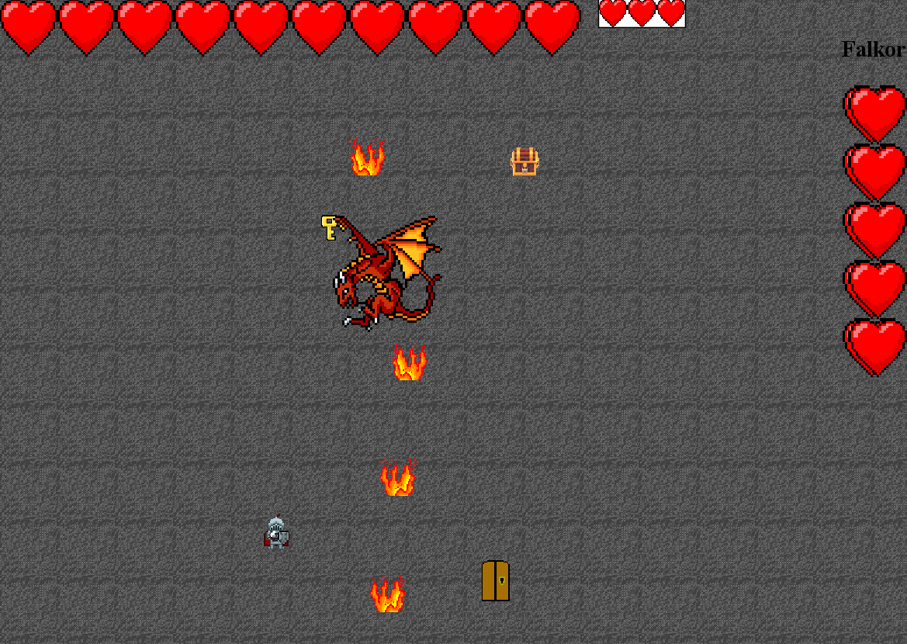

# Overview
Escape the Dungeon is a dungeon crawler where you have the option to play as a knight or a wizard.
Escape or face your foes who stand in your way. 
Pick up items to better your odds.
# Features
- Main Menu

- How To Play instructions
- Audio can be turned on/off.
- Player Winning/Losing Screen has an option to restart.

- Player can choose to play as a Knight or a Wizard.
- The Knight can attack from close range.
- The Wizard can attack from long range.
- Player and Bosses have a health display.

- Player needs the key to open the door and access the next room.
- Player can dash and move in any direction.
- Player can pick up items and weapon upgrades.
- Each room is randomized.

- All enemies can detect the player if the player is within range.
- All enemies can damage the player if the player is touching the enemy.
- Some enemies can attack the player from long range.
- There are multiple enemy and item types.

# Features not implemented
- Select Level
- Tutorial
- Different types of weapons

# How to play
- Move the mouse and use the Left-Click button to navigate the main menu and toggle audio
- Press w, a, s, d to move up, down, left, right, respectively
- Press SHIFT to dash in the direction of the mouse
- Press the Left-Click button on the mouse to attack in the direction of the mouse
- Press e to interact with objects
- Press r to use a heart item

# How to build
- Go to releases
- Download tea-win-x64.zip
- Extract the zip file
- Open the extracted folder
- Open the bin folder
- Run the tea.bat file
